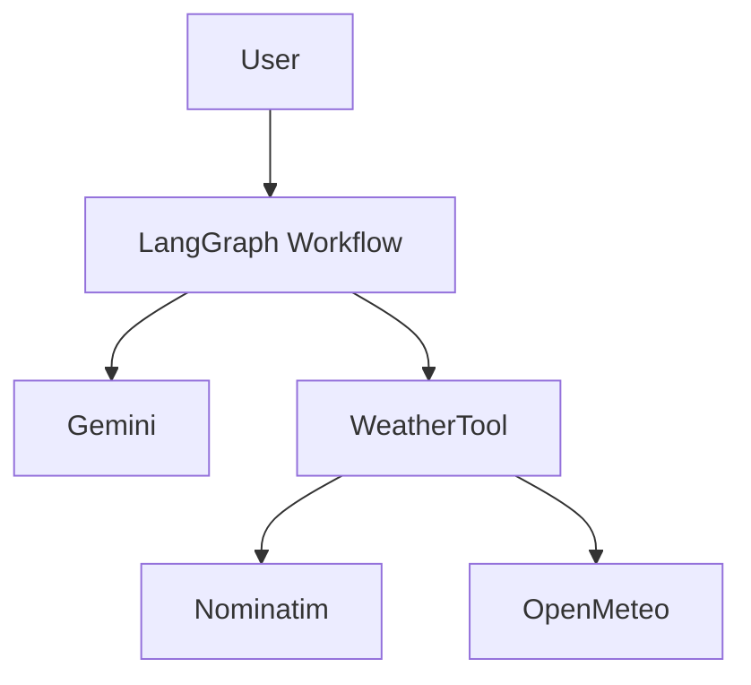
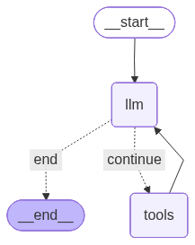

# Agentic Weather Forecast

## Problem
Weather questions are a practical case for agentic systems because the answer often depends on more than a single model completion. A useful assistant needs to interpret the request, decide when external data is required, resolve location names, call a forecast service, and use the result to answer follow-up questions.

This project explores that workflow as a compact Python application built with Gemini, LangChain tools, and LangGraph.

## Original Architecture
This repository is based on Google's example, [ReAct agent from scratch with Gemini and LangGraph](https://ai.google.dev/gemini-api/docs/langgraph-example).

The reference architecture models the agent as a graph:

- `State`: shared conversation state, including message history and execution metadata.
- `Nodes`: execution units that call the model or run tools.
- `Edges`: routing logic that decides whether the agent should continue or finish.

The core control flow is:

`llm -> tools -> llm -> END`

In that loop, the model decides whether it needs a tool, the tool returns an observation, and the graph routes the updated state back to the model until no more tool calls are required.

## Learning Goals
This repository is part of a broader study path in agentic software engineering. The goal is not only to reproduce a tutorial pattern, but to evolve it into a small system that makes architectural tradeoffs visible.

The current implementation focuses on:

- modeling an agent loop explicitly instead of hiding it inside a single function call;
- separating model configuration, tool execution, and graph orchestration;
- treating external weather and geocoding APIs as replaceable integrations;
- building a foundation that can later support service boundaries, observability, and deployment concerns.

## Why LangGraph?
LangGraph is used because the important behavior in this project is workflow behavior, not only prompt behavior.

It provides:

- explicit workflow modeling, so the model call, tool call, and termination decision are visible in code;
- stateful execution, so message history and intermediate observations move through the graph consistently;
- tool orchestration, so external API calls can be represented as part of the agent loop;
- agent loops, where the model can request tools repeatedly before producing a final answer;
- a path toward human-in-the-loop checkpoints, review steps, and more controlled execution in future versions.

For this project, LangGraph keeps the ReAct pattern small enough to inspect while still matching the shape of larger production agent systems.

## Architectural Decisions

Current decisions:

- LangGraph for explicit workflow orchestration.
- Gemini as the reasoning engine.
- Open-Meteo as the weather provider.
- Nominatim for geocoding.

Future decisions under evaluation:

- REST API for external consumers.
- gRPC for internal service communication.
- OpenTelemetry for distributed observability.
- Kubernetes for deployment and scaling.

## Project Structure
The source code is organized by responsibility:

```text
src/agentic_weather_forecast/
|-- core/       # environment-backed settings
|-- tools/      # LangChain-compatible weather tools
|-- llm/        # Gemini model setup and tool binding
|-- graph/      # state, nodes, routing, and compiled workflow
|-- agents/     # reserved for higher-level orchestration
`-- prompts/    # reserved for prompt assets
```

Supporting files:

```text
docs/          # generated architecture diagrams and project documentation
test/          # pytest tests mirroring source modules
pyproject.toml # package metadata and runtime dependencies
uv.lock        # locked dependency graph
```

The `agents` and `prompts` areas are planned extension points; they are not central to the current implementation yet.

## Architecture
The current application keeps the Google reference loop and packages it as a focused weather assistant.

The main adaptations are:

- Gemini is configured through `langchain-google-genai`.
- LangGraph owns the workflow and message routing.
- `geopy` with Nominatim resolves location names to coordinates.
- Open-Meteo provides hourly forecast data.
- The CLI acts as a thin entry point for exercising the graph locally.





The compiled graph follows this sequence:

1. `call_model` invokes Gemini with the current message history.
2. `should_continue` checks whether the latest assistant message contains tool calls.
3. `call_tool` executes the requested weather tool and appends tool messages.
4. The graph returns to the model until the assistant stops requesting tools.

## Getting Started
Requirements:

- Python 3.11
- `uv`
- `GEMINI_API_KEY` set in the environment

Install dependencies:

```bash
uv sync
```

Optional local environment setup:

```bash
cp .env.example .env
```

Run the CLI:

```bash
uv run agentic-weather-forecast
```

Run the package module directly:

```bash
uv run python -m agentic_weather_forecast
```

## How It Works
At runtime, the graph receives a message list and sends it to Gemini. If Gemini requests weather data, the tool layer:

1. geocodes the requested location;
2. calls Open-Meteo for the requested date;
3. returns hourly temperature data to the graph.

The graph appends that tool output to the conversation state. Gemini can then answer directly or request another tool call if the conversation requires more data.

## Roadmap
The project is intentionally small today, with future phases aimed at turning the learning scaffold into a more complete agentic service.

Phase 1: Single Agent

- [x] Package the tutorial pattern as a Python application.
- [x] Separate settings, tool code, model setup, and graph construction.
- [x] Integrate Gemini, LangGraph, Nominatim, and Open-Meteo.
- [x] Generate a graph diagram for the current workflow.

Phase 2: Service Layer

- [ ] Add a REST API around the graph.
- [ ] Introduce request and response models for weather conversations.
- [ ] Add a BFF layer for a future web or mobile client.
- [ ] Replace hardcoded local prompts with runtime input.

Phase 3: Observability

- [ ] Evaluate gRPC for internal service boundaries.
- [ ] Add structured logging, traces, metrics, and correlation IDs.
- [ ] Expand tests across tools, graph routing, and API behavior.
- [ ] Add resilience patterns for external API failures and rate limits.

Phase 4: Kubernetes & Cloud

- [ ] Containerize the application.
- [ ] Add Kubernetes manifests or Helm chart structure.
- [ ] Configure environment-specific settings.
- [ ] Deploy to a cloud environment with managed secrets and observability.

## Limitations
- The project depends on external services for geocoding, weather data, and Gemini inference.
- Weather results depend on the quality of the location match returned by Nominatim.
- The current CLI prompt is hardcoded in `__main__.py`.
- There is no formal test suite configured yet.

## Development
Use `pytest` for new tests and mock external HTTP, geocoding, and LLM calls. Tests should not require Open-Meteo, Nominatim, Gemini, network access, or API keys.

Useful coverage areas:

- successful weather tool execution;
- unknown location handling;
- malformed Open-Meteo payloads;
- Gemini and tool-routing behavior in the graph.

When tests are added, run them with:

```bash
uv run pytest
```

## References
- [Google Gemini LangGraph example](https://ai.google.dev/gemini-api/docs/langgraph-example)
- [LangGraph](https://langchain-ai.github.io/langgraph/)
- [LangChain Google GenAI](https://docs.langchain.com/oss/python/integrations/chat/google_generative_ai)
- [Open-Meteo API](https://open-meteo.com/)
- [Nominatim](https://nominatim.org/)
